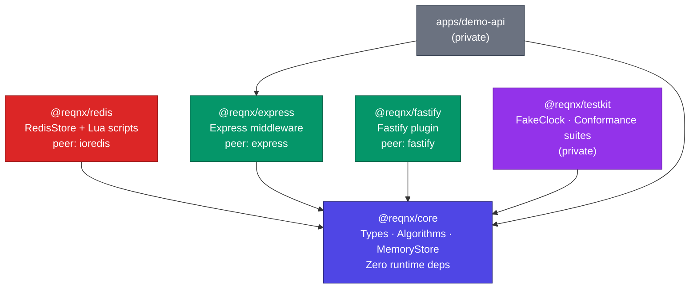
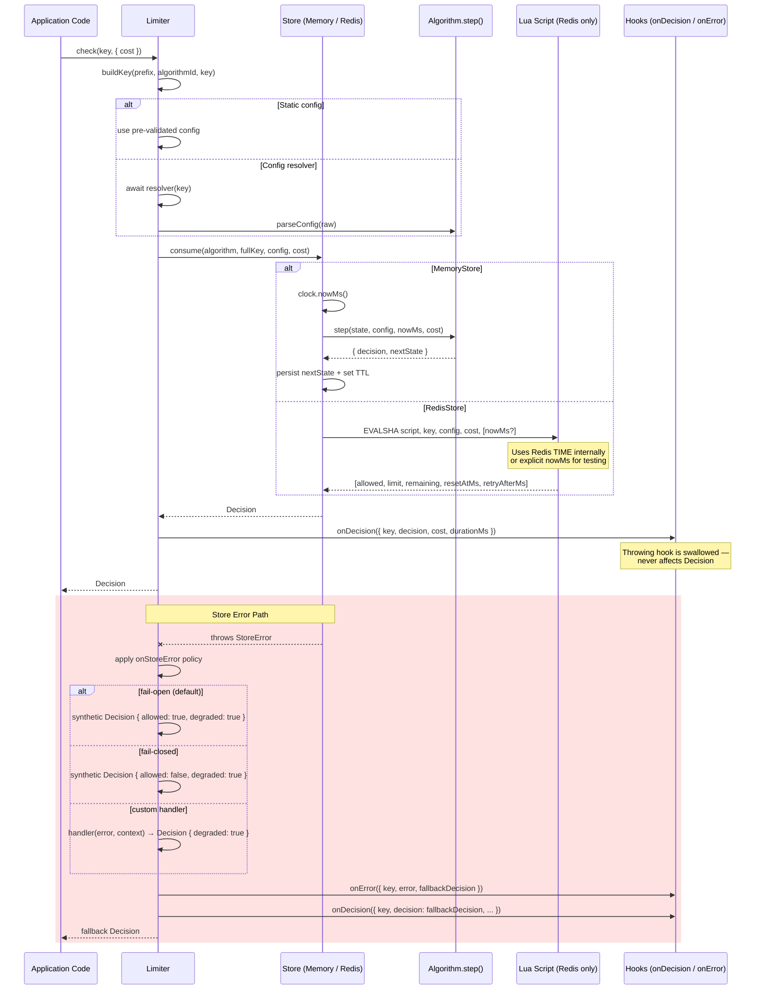

# REQNX Architecture

> Pluggable, distributed-ready rate limiter for Node.js

## Package Dependency Graph



**Dependency rule:** Everything may depend on `core`; `core` depends on nothing; adapters never depend on each other. Enforced by `scripts/check-deps.ts`.

---

## Request Flow: `limiter.check()` → Decision



---

## Core Principles

1. **Pure core, impure edges.** An algorithm is a pure, deterministic state-transition function: `(state | undefined, config, nowMs, cost) → (decision, nextState)`. No I/O, no `Date.now()`, no randomness.

2. **Atomicity belongs to the store.** Check-and-update must be atomic. MemoryStore runs `step()` synchronously. RedisStore runs equivalent Lua. Stores are NOT generic get/set adapters.

3. **The store owns the clock.** MemoryStore: injectable `Clock` (FakeClock in tests). RedisStore: `TIME` inside Lua. Lua scripts also accept optional explicit `nowMs` for deterministic testing.

4. **One truth, two executors.** Each algorithm exists as pure TS `step()` and as a Lua port. Conformance suites replay identical sequences against both, requiring identical decisions.

5. **Core is dependency-free and portable.** `@reqnx/core` has zero runtime dependencies and no `node:` imports. Runs on Node, Bun, Deno, edge runtimes.

6. **Fail explicitly.** Denied requests are normal return values, never exceptions. Store failures surface as `StoreError` handled by a configurable policy (default: fail-open).

---

## Key Schema

```
reqnx:{prefix}:{algorithmId}:{identity}
```

- **Max total key length:** 512 bytes
- **Long keys:** SHA-256 hashed (hex), prefixed with `h:`
- **MemoryStore:** configurable `maxKeys` cap (default 100,000) with random eviction
- **Redis:** per-identity state in ONE key (hash or sorted set) for Cluster safety

---

## State Versioning

Each algorithm declares `stateVersion: number`. When a store encounters state written by a different version, it resets the key instead of crashing. This enables safe rolling deploys.
